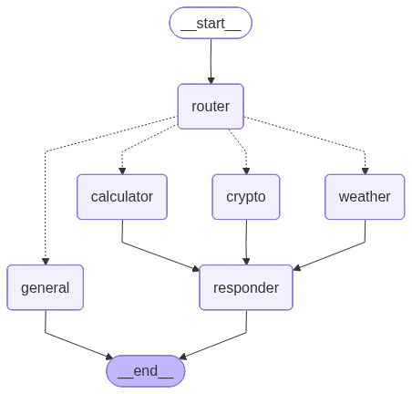

# 🤖 Multi-Agent AI System

<p align="center">
  
</p>

<p align="center">
  
  
  
  
  
</p>

---

## 🌟 Overview

The **Multi-Agent AI System** is a production-grade intelligent assistant orchestrated via **LangGraph**. It utilizes a sophisticated **Router-Worker-Responder** architecture to analyze user intent and dispatch queries to specialized autonomous agents. 

Whether it's fetching real-time weather, executing complex mathematical logic, or tracking cryptocurrency market trends, the system ensures precision and natural language synthesis in every interaction.

---

## 🚀 Key Features

- 🧠 **Intelligent Logic Router**: High-precision intent extraction using Llama 3.1.
- 🌤️ **Weather Agent**: Real-time atmospheric data via OpenWeatherMap API.
- 🔢 **Calculator Agent**: Robust mathematical expression evaluation.
- 📈 **Crypto Tracker**: Live market performance and price tracking.
- 🎨 **Modern Dashboard**: Sleek React/Vite interface with dark/light mode support.
- 📊 **Agent Trace**: Visual execution logs showing the "thinking" process of the agents.

---

## 🏗️ Architecture

The system is built on a directed acyclic graph (DAG) where nodes represent specialized concerns:

1. **Router**: Analyzes input and Extracts parameters (`city`, `expression`, `symbol`).
2. **Workers**: Specialized tools (Weather, Calculator, Crypto) or General LLM loop.
3. **Responder**: Synthesizes structured tool data into a human-friendly response.

<p align="center">
  
</p>

---

## 📂 Project Structure

```text
Multi_Agent_AI_System/
├── assets/               # Visual branding and assets
├── backend/
│   └── src/
│       ├── main.py       # LangGraph orchestration and graph definition
│       ├── state.py      # Typed shared state for the agent network
│       ├── config_llm.py # Groq and model hyperparameter configuration
│       ├── decisions/    # Zero-shot routing and intent extraction logic
│       └── tools/        # Specialized agent implementation (Weather, Calc, Crypto)
├── frontend/             # Dashboard source (React + Vite + CSS)
├── server.py             # FastAPI entry point wrapping the agent logic
├── visualize_graph.py    # Utility to export the graph architecture
└── .env.example          # Template for required API keys
```

---

## 🛠️ Installation & Setup

### 1. Prerequisites
- Python 3.10+
- Node.js & npm
- API Keys: [Groq](https://console.groq.com/), [OpenWeatherMap](https://openweathermap.org/)

### 2. Backend Setup
```bash
# Clone the repository
git clone https://github.com/SyedSarimAbbas/Multi-Agent-System.git
cd Multi-Agent-System

# Create and activate virtual environment
python -m venv .venv
source .venv/bin/activate  # Windows: .venv\Scripts\activate

# Install dependencies
pip install -r requirements.txt

# Configure environment
cp .env.example .env
# Edit .env with your actual API keys
```

### 3. Frontend Setup
```bash
cd frontend
npm install
```

---

## 📖 Usage

### Running the System
1. **Start Backend**: `python server.py` (Runs on http://localhost:8000)
2. **Start Frontend**: `npm run dev` (Runs on http://localhost:5173)

### Example Queries
- *"What is the weather in Islamabad, Pakistan?"*
- *"Calculate 1283 * 23.5 / (12 + 4)"*
- *"Show me the current price of Bitcoin"*
- *"Tell me a joke about robots"*

---

## 🛠️ Tech Stack & Logistics

- **Language**: 
- **Framework**: 
- **UI**: 
- **Orchestration**: LangGraph / LangChain
- **Intelligence**: Llama 3.1-8b via Groq Cloud

---

## 🤝 Contributing

Contributions are welcome! Please feel free to submit a Pull Request. For major changes, please open an issue first to discuss what you would like to change.

---

## 📜 License

This project is licensed under the MIT License - see the [LICENSE](LICENSE) file for details.

---

## 👤 Author

**Sarim Abbas**
- GitHub: [@SyedSarimAbbas](https://github.com/SyedSarimAbbas)
- Project: [Multi-Agent-System](https://github.com/SyedSarimAbbas/Multi-Agent-System)

---

<p align="center">Made by Syed Sarim Abbas.</p>
